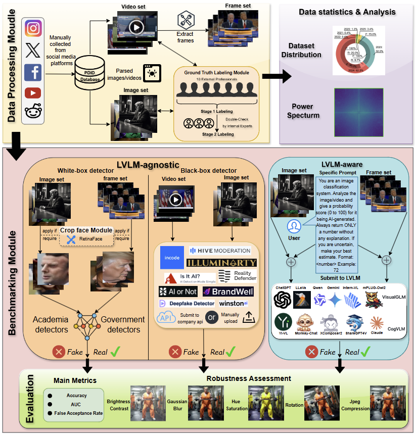

# Political_Deepfakes_Benchmark

This repository is the official implementation of our paper Benchmarking Wide Detectors for Political Deepfakes

<figure>
  
</figure>


## 📁 Download Dataset
You can access and download the datasets from the following links:

- **Image and Video Data**: [Link 1](https://purdue0-my.sharepoint.com/:f:/g/personal/lin1785_purdue_edu/EidE546IvUdIsS_3LFCQX3MBGyS6lKtW-XiuHJwnIvpdYw?e=0MVjtJ) | [Link 2](https://purdue0-my.sharepoint.com/:f:/g/personal/lin1785_purdue_edu/EpQPBynMPlJDkdQ05Q-Ej5EBNzoiQIhZgFHLo6cbrnYNMw?e=0pll1P)
- **Labels**: [Download here](https://purdue0-my.sharepoint.com/:f:/g/personal/lin1785_purdue_edu/EpQPBynMPlJDkdQ05Q-Ej5EBNzoiQIhZgFHLo6cbrnYNMw?e=0pll1P)


## ⚙️ Evaluation

### Evaluate Academic Detectors

Academic detectors are from work [AI-Face](https://github.com/Purdue-M2/AI-Face-FairnessBench)

1. Download pre-trained checkpoints: [link](https://purdue0-my.sharepoint.com/:f:/g/personal/lin1785_purdue_edu/EsNU0g9QQP5Dgf74rgmydfoB-gWRy2zRpqnuE8sONgQ5mw?e=1wvy2j).

2. Environment installation
 
    You can run the following script to configure the necessary environment:

    ```
    cd academia-bench
    conda create -n academia-bench python=3.9.0
    conda activate academia-bench
    pip install -r requirements.txt
    ```

3. Run evaluation:

    ```
    python inference.py
    ```

### Evaluate Government Detectors

1. Navigate to the government benchmark directory:
    ```
    cd government-bench
    ``` 

2. To evaluate **CNNDetection**, go to the `CNNDetection-master` directory and follow the [README.md](government-bench/CNNDetection-master/README.md)
 for detailed instructions.

   - Download the official checkpoint from their provided link in [README.md](government-bench/CNNDetection-master/README.md).  
   - Place your evaluation data in the corresponding data folder.  
   - Then run the inference script:
     ```bash
     python inference.py
     ```

3. Same steps for evaluating [KitwareDetector](government-bench/generated-image-detection-main/README.md) and [GANattribution](government-bench/ganattribution-master/README.MD)

### Evaluate VLM 

Most of the code is borrowed from [Forensics-Bench](https://arxiv.org/abs/2503.15024)

1. Navigate to the vlm benchmark directory:
    ```
    cd vlm-bench
    pip install -e .
    ``` 

2. Configuration

    **VLM Configuration**: All VLMs are configured in `vlmeval/config.py`. Few legacy VLMs (like MiniGPT-4, LLaVA-v1-7B) requires additional configuration (configuring the code / model_weight root in the config file). During evaluation, you should use the model name specified in `supported_VLM` in `vlmeval/config.py` to select the VLM. Make sure you can successfully infer with the VLM before starting the evaluation with the following command `vlmutil check {MODEL_NAME}`.

    **Transformers Version Recommendation:**

    Note that some VLMs may not be able to run under certain transformer versions, we recommend the following settings to evaluate each VLM:

  - **Please use** `transformers==4.33.0` **for**: `Qwen series`, `Monkey series`, `InternLM-XComposer Series`, `mPLUG-Owl2`, `VisualGLM`, `MMAlaya`, `InstructBLIP series`.
  - **Please use** `transformers==4.37.0` **for**: `LLaVA series`, `ShareGPT4V series`, `LLaVA (XTuner)`, `CogVLM Series`, `Yi-VL Series`, `DeepSeek-VL series`, `InternVL series`.
  - **Please use** `transformers==latest` **for**: `LLaVA-Next series`.

3. Evaluation

    Run the inference script:
    ```
    python inference.py
    ```